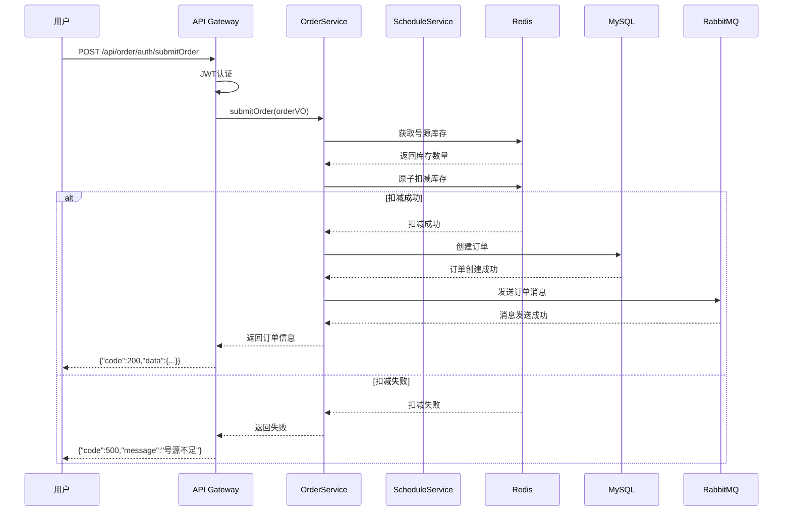
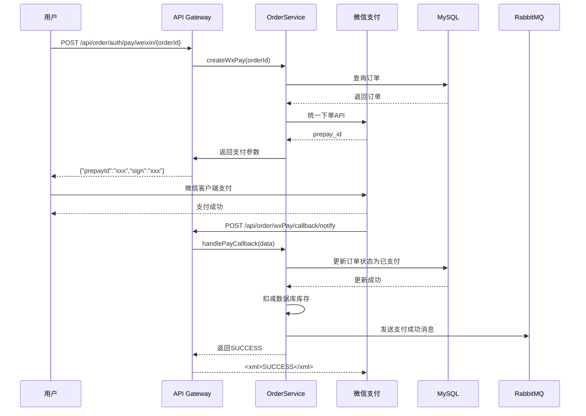

# 医院预约挂号系统 - 项目阅读指南

## 目录

| 章节 | 内容 | 预计时间 |
| :--- | :--- | :--- |
| 第一章 | 项目结构概览 | 30分钟 |
| 第二章 | 开发环境与依赖 | 30分钟 |
| 第三章 | 核心服务分析（上） | 2小时 |
| 第四章 | 核心服务分析（下） | 2小时 |
| 第五章 | 关键技术实现 | 3小时 |
| 第六章 | 业务流程追踪 | 2小时 |
| 第七章 | 总结与扩展 | 1小时 |

---

## 第一章：项目结构概览

### 1.1 项目整体架构

```
yygh_parent/                           # Maven 父工程
├── common/                            # 公共模块
│   ├── common_util/                   # 公共工具（异常、JWT、Result、短信）
│   └── service_util/                  # 服务工具（配置、HTTP签名、RabbitMQ）
├── model/                             # 实体类/VO/枚举
├── service_client/                    # Feign远程调用客户端
│   ├── service_cmn_client/
│   ├── service_hosp_client/
│   ├── service_order_client/
│   └── service_user_client/
├── server_gateway/                    # API 网关（统一入口）
├── service/                           # 业务微服务
│   ├── service_cmn/                   # 数据字典服务 :8202
│   ├── service_hosp/                  # 医院管理服务 :8201
│   ├── service_order/                 # 预约订单服务 :8206
│   ├── service_oss/                   # 文件存储服务 :8205
│   ├── service_statistics/            # 统计服务 :8208
│   └── service_user/                  # 用户服务 :8160
├── hospital-manage/                   # 医院后台管理系统
└── sql/                               # 数据库脚本
```

### 1.2 服务职责划分

| 服务模块 | 职责描述 | 核心功能 |
| :--- | :--- | :--- |
| `server_gateway` | API 网关 | 请求路由、认证授权、限流 |
| `service_user` | 用户服务 | 用户注册/登录、用户信息管理、就诊人管理、微信登录 |
| `service_hosp` | 医院服务 | 医院、科室、医生、排班管理 |
| `service_order` | 订单服务 | 预约订单、库存扣减、微信支付 |
| `service_cmn` | 公共服务 | 数据字典、Excel导入导出 |
| `service_oss` | 文件服务 | 图片上传、文件管理 |
| `service_statistics` | 统计服务 | 订单统计 |
| `service_client` | Feign客户端 | 服务间远程调用（带FallbackFactory熔断降级） |
| `hospital-manage` | 医院后台管理 | 医院管理系统，订单状态变更推送MQ |

### 1.3 技术栈清单

| 分类 | 技术 | 版本 |
| :--- | :--- | :--- |
| 语言 | Java | 8+ |
| 框架 | Spring Boot | 2.7.18 |
| 微服务 | Spring Cloud | 2021.0.9 |
| 微服务 | Spring Cloud Alibaba | 2021.0.6.1 |
| 注册中心 | Nacos | 2.x |
| 网关 | Spring Cloud Gateway | 3.x |
| ORM | MyBatis-Plus | 3.5.3.1 |
| 缓存 | Redis | 6.x |
| 分布式锁 | Redisson | 3.23.5 |
| 消息队列 | RabbitMQ | 3.9.x |
| 数据库 | MySQL | 8.x |
| Excel处理 | EasyExcel | 2.2.0-beta2 |
| 支付 | 微信支付 SDK | 3.x |
| API文档 | Swagger | 3.0.0 |
| 远程调用 | OpenFeign | 内置 |

---

## 第二章：开发环境与依赖

### 2.1 环境准备

**必须安装的服务：**
1. **JDK 8+** - Java 开发环境
2. **MySQL 8.x** - 关系型数据库
3. **Redis 6.x** - 缓存服务
4. **RabbitMQ 3.9.x** - 消息队列
5. **Nacos 2.x** - 服务注册中心

**各服务端口分配：**

| 服务 | 端口 |
| :--- | :--- |
| server_gateway | 8888 |
| service_user | 8160 |
| service_hosp | 8201 |
| service_cmn | 8202 |
| service_oss | 8205 |
| service_order | 8206 |
| service_statistics | 8208 |
| hospital-manage | 9998(dev)/9999(test) |

### 2.2 依赖关系分析

查看 `pom.xml` 了解项目依赖：

**父工程依赖管理**：
```xml
<parent>
    <groupId>org.springframework.boot</groupId>
    <artifactId>spring-boot-starter-parent</artifactId>
    <version>2.7.18</version>
</parent>

<dependencyManagement>
    <dependencies>
        <!-- Spring Cloud -->
        <dependency>
            <groupId>org.springframework.cloud</groupId>
            <artifactId>spring-cloud-dependencies</artifactId>
            <version>2021.0.9</version>
        </dependency>
        <!-- Spring Cloud Alibaba -->
        <dependency>
            <groupId>com.alibaba.cloud</groupId>
            <artifactId>spring-cloud-alibaba-dependencies</artifactId>
            <version>2021.0.6.1</version>
        </dependency>
    </dependencies>
</dependencyManagement>
```

**参考文件**：[pom.xml](file:///d:/javaproject/yygh-master/yygh-master/后台代码/yygh_parent/pom.xml)

### 2.3 配置文件说明

每个服务都有 `application.properties` 配置文件，包含：
- 服务端口与名称
- Nacos 注册配置
- 数据库连接配置
- Redis 配置
- RabbitMQ 配置

**关键配置示例**（service_user）：
```yaml
spring:
  cloud:
    nacos:
      discovery:
        server-addr: localhost:8848
  datasource:
    url: jdbc:mysql://localhost:3306/yygh_user?useSSL=false
    username: root
    password: password
  redis:
    host: localhost
    port: 6379
  rabbitmq:
    host: localhost
    port: 5672
```

---

## 第三章：核心服务分析（上）

### 3.1 从网关开始 - server_gateway

**为什么先看网关？**
- 网关是所有请求的入口
- 理解认证授权机制
- 了解路由规则

**关键文件**：

| 文件 | 作用 |
| :--- | :--- |
| `AuthGlobalFilter.java` | JWT 认证过滤器 |
| `application.properties` | 路由配置 |

**核心代码分析**：
```java
@Override
public Mono<Void> filter(ServerWebExchange exchange, GatewayFilterChain chain) {
    ServerHttpRequest request = exchange.getRequest();
    String path = request.getURI().getPath();

    // 跳过不需要认证的路径
    if(antPathMatcher.match("/api/**/auth/**", path)) {
        Long userId = this.getUserId(request);
        if(StringUtils.isEmpty(userId)) {
            return out(response, ResultCodeEnum.LOGIN_AUTH);
        }
    }
    return chain.filter(exchange);
}
```

**参考文件**：[AuthGlobalFilter.java](file:///d:/javaproject/yygh-master/yygh-master/后台代码/yygh_parent/server_gateway/src/main/java/com/yygh/gateway/filter/AuthGlobalFilter.java)

### 3.2 用户服务 - service_user

**核心功能**：
- 用户注册/登录
- 用户信息管理
- 就诊人管理
- 微信登录

**关键文件结构**：
```
service_user/
├── api/                 # REST API 控制层
│   ├── UserInfoApiController.java
│   ├── PatientApiController.java
│   └── WxApiController.java
├── controller/          # 后台管理控制层
│   └── UserController.java
├── service/             # 业务逻辑层
│   ├── UserInfoService.java
│   ├── PatientService.java
│   └── impl/UserInfoServiceImpl.java
│   └── impl/PatientServiceImpl.java
├── mapper/              # 数据访问层
│   ├── UserInfoMapper.java
│   └── PatientMapper.java
└── utils/               # 工具类
    ├── HttpClientUtils.java
    └── ConstantWxPropertiesUtils.java
```

**用户登录流程**：
```
POST /api/user/auth/login
    ↓
UserInfoApiController.login()
    ↓
UserInfoServiceImpl.login()
    ↓
验证手机号和验证码
    ↓
生成 JWT Token
    ↓
返回用户信息 + Token
```

**参考文件**：[UserInfoServiceImpl.java](file:///d:/javaproject/yygh-master/yygh-master/后台代码/yygh_parent/service/service_user/src/main/java/com/yygh/user/service/impl/UserInfoServiceImpl.java)

### 3.3 公共服务 - service_cmn

**核心功能**：
- 数据字典管理
- Excel 数据导入导出

**数据字典设计**：
```java
@Data
@TableName("dict")
public class Dict {
    @TableId(type = IdType.AUTO)
    private Long id;
    private Long parentId;      // 父节点ID
    private String name;        // 名称
    private String value;       // 值
    private Integer dictCode;   // 编码
}
```

**参考文件**：[Dict.java](file:///d:/javaproject/yygh-master/yygh-master/后台代码/yygh_parent/service/service_cmn/src/main/java/com/yygh/cmn/entity/Dict.java)

---

## 第四章：核心服务分析（下）

### 4.1 医院服务 - service_hosp

**核心功能**：
- 医院信息管理
- 科室管理
- 医生管理
- 排班管理

**关键实体关系**：
```
Hospital (医院)
    ↓ 1:N
Department (科室)
    ↓ 1:N
Doctor (医生)
    ↓ 1:N
Schedule (排班)
    ↓ 1:N
Order (订单)
```

**排班管理核心代码**：
```java
public IPage<Schedule> selectPage(Long page, Long limit, ScheduleQueryVo scheduleQueryVo) {
    QueryWrapper<Schedule> wrapper = new QueryWrapper<>();

    if(StringUtils.isNotEmpty(scheduleQueryVo.getHoscode())) {
        wrapper.eq("hoscode", scheduleQueryVo.getHoscode());
    }
    if(StringUtils.isNotEmpty(scheduleQueryVo.getDepcode())) {
        wrapper.eq("depcode", scheduleQueryVo.getDepcode());
    }

    return scheduleMapper.selectPage(new Page<>(page, limit), wrapper);
}
```

**参考文件**：[ScheduleServiceImpl.java](file:///d:/javaproject/yygh-master/yygh-master/后台代码/yygh_parent/service/service_hosp/src/main/java/com/yygh/hosp/service/impl/ScheduleServiceImpl.java)

### 4.2 文件服务 - service_oss

**核心功能**：
- 图片上传
- 文件管理

**上传流程**：
```java
@PostMapping("/fileUpload")
public Result fileUpload(MultipartFile file) {
    String url = fileService.upload(file);
    return Result.ok(url);
}
```

**参考文件**：[FileApiController.java](file:///d:/javaproject/yygh-master/yygh-master/后台代码/yygh_parent/service/service_oss/src/main/java/com/yygh/oss/controller/FileApiController.java)

### 4.3 订单服务 - service_order（核心）

**核心功能**：
- 订单创建
- 库存扣减
- 微信支付
- 订单状态管理
- 订单状态消息消费（OrderStatusReceiver）

**关键文件结构**：
```
service_order/
├── api/
│   ├── OrderApiController.java
│   └── WeixinController.java
├── service/
│   ├── OrderService.java
│   ├── WeixinService.java
│   ├── PaymentService.java
│   └── impl/OrderServiceImpl.java
│   └── impl/WeixinServiceImpl.java
├── mapper/
│   ├── OrderMapper.java
│   ├── PaymentInfoMapper.java
│   └── RefundInfoMapper.java
├── receiver/
│   └── OrderStatusReceiver.java
└── utils/
    ├── ConstantPropertiesUtils.java
    └── HttpClient.java
```

**订单状态流转**：
```
待支付 → 已支付 → 已就诊 → 已完成
    ↓           ↓
    └── 已取消 ←──
```

---

## 第五章：关键技术实现

### 5.1 JWT 认证机制

**Token 生成**（位于 `common/common_util/.../helper/JwtHelper.java`）：
```java
public String createToken(Long userId, String userName) {
    Map<String, Object> claims = new HashMap<>();
    claims.put("userId", userId);
    claims.put("userName", userName);

    return Jwts.builder()
            .setClaims(claims)
            .setExpiration(new Date(System.currentTimeMillis() + EXPIRE_TIME))
            .signWith(Keys.hmacShaKeyFor(SECRET.getBytes()))
            .compact();
}
```

**参考文件**：[JwtHelper.java](file:///d:/javaproject/yygh-master/yygh-master/后台代码/yygh_parent/common/common_util/src/main/java/com/yygh/common/helper/JwtHelper.java)

### 5.2 高并发库存扣减

**三层防护机制**：

1. **Redis 原子扣减**：
```java
RAtomicLong atomicLong = redissonClient.getAtomicLong(redisKey);
boolean success = atomicLong.compareAndSet(expected, expected - 1);
```

2. **分布式锁**：
```java
RLock lock = redissonClient.getLock("order:lock:" + orderId);
try {
    lock.lock();
    // 业务逻辑
} finally {
    lock.unlock();
}
```

3. **数据库乐观锁**：
```java
@Version
private Integer version;
```

**参考文件**：[OrderServiceImpl.java](file:///d:/javaproject/yygh-master/yygh-master/后台代码/yygh_parent/service/service_order/src/main/java/com/yygh/order/service/impl/OrderServiceImpl.java)

### 5.3 RabbitMQ 消息处理

**消息发送**（位于 `common/service_util/.../service/RabbitService.java`）：
```java
rabbitTemplate.convertAndSend(exchange, routingKey, message);
```

**消息消费**（订单状态变更，位于 `service_order/.../receiver/OrderStatusReceiver.java`）：
```java
@RabbitListener(queues = MqConfig.ORDER_QUEUE)
public void handleOrderStatus(Map<String, Object> message, Message msg, Channel channel) throws IOException {
    try {
        Long hosRecordId = Long.valueOf(message.get("hosRecordId").toString());
        Integer orderStatus = Integer.valueOf(message.get("orderStatus").toString());
        orderService.updateOrderStatus(hosRecordId, orderStatus);
        // 手动确认
        channel.basicAck(msg.getMessageProperties().getDeliveryTag(), false);
    } catch (Exception e) {
        log.error("处理订单状态变更消息失败", e);
        channel.basicNack(msg.getMessageProperties().getDeliveryTag(), false, false);
    }
}
```

**交换机/队列定义**（位于 `MqConfig.java`）：
```java
public static final String ORDER_EXCHANGE = "yygh.order.exchange";
public static final String ORDER_QUEUE = "yygh.order.queue";
public static final String ORDER_ROUTING_KEY = "yygh.order.status";
```

**参考文件**：[OrderStatusReceiver.java](file:///d:/javaproject/yygh-master/yygh-master/后台代码/yygh_parent/service/service_order/src/main/java/com/yygh/order/receiver/OrderStatusReceiver.java)

### 5.4 微信支付集成

**支付流程**：
```
1. 统一下单 → 获取 prepay_id
2. 生成支付签名 → 返回前端
3. 前端调起微信支付
4. 支付回调 → 更新订单状态
```

**回调处理**：
```java
@PostMapping("/callback/notify")
public String callbackNotify(HttpServletRequest request) {
    // 验证签名
    // 解析支付结果
    // 更新订单状态
    return "<xml><return_code><![CDATA[SUCCESS]]></return_code></xml>";
}
```

**参考文件**：[WeixinController.java](file:///d:/javaproject/yygh-master/yygh-master/后台代码/yygh_parent/service/service_order/src/main/java/com/yygh/order/api/WeixinController.java)

### 5.5 Redis 缓存策略

**缓存使用场景**：
- 数据字典（Spring Cache `@Cacheable`）
- 医院/科室/排班信息（Spring Cache `@Cacheable`）
- 号源库存（实时更新，Redisson RAtomicLong）

**Spring Cache 实战**（以医院缓存为例）：
```java
@Cacheable(value = "hospital", key = "#hoscode")
public Hospital getByHoscode(String hoscode) {
    Hospital hospital = hospitalMapper.selectByHoscode(hoscode);
    return hospital;
}
```

**参考文件**：[HospitalServiceImpl.java](file:///d:/javaproject/yygh-master/yygh-master/后台代码/yygh_parent/service/service_hosp/src/main/java/com/yygh/hosp/service/impl/HospitalServiceImpl.java)

---

## 第六章：业务流程追踪

### 6.1 预约挂号完整流程



### 6.2 支付流程



### 6.3 退号流程

```
1. 用户发起退号请求
2. 验证订单状态（必须是已支付）
3. 验证退号时间（就诊前2小时）
4. 更新订单状态为已取消
5. 回补号源（Redis + MySQL）
6. 发起微信退款
7. 发送退号通知
```

---

## 第七章：总结与扩展

### 7.1 项目亮点总结

| 技术点 | 实现方式 | 解决的问题 |
| :--- | :--- | :--- |
| 高并发 | Redis原子扣减 + Redisson锁 + 乐观锁 | 号源超卖问题 |
| 认证授权 | JWT + Gateway Filter | 统一认证 |
| 异步处理 | RabbitMQ消息队列 | 订单解耦 |
| 缓存策略 | Spring Cache + @Cacheable | 数据字典/医院信息缓存 |
| 分布式锁 | Redisson RLock + RAtomicLong | 库存并发安全 |
| 远程调用 | OpenFeign + FallbackFactory | 服务间解耦与熔断降级 |
| Excel导入 | EasyExcel | 大数据量导入 |
| API文档 | Swagger 3.0.0 (knife4j) | 接口调试 |

### 7.2 代码优化建议

**潜在优化点**：
1. **已集成 Sentinel**：关注限流规则配置
2. **已集成 Swagger**：通过 knife4j 查看接口文档
3. **引入链路追踪**：使用 SkyWalking
4. **配置中心**：使用 Nacos Config 统一管理配置
5. **单元测试**：增加测试覆盖率

### 7.3 扩展功能建议

**可新增功能**：
1. **候补排队**：号源释放时自动通知候补用户
2. **家庭账户**：一人绑定多个家庭成员
3. **信用积分**：预约履约记录积分
4. **智能推荐**：根据历史记录推荐医生
5. **在线问诊**：图文/视频问诊功能

### 7.4 学习路线建议

| 阶段 | 目标 | 时间 |
| :--- | :--- | :--- |
| 第一周 | 理解项目结构和基础服务 | 5天 |
| 第二周 | 深入订单服务和支付流程 | 5天 |
| 第三周 | 掌握高并发和分布式技术 | 5天 |
| 第四周 | 动手实践和功能扩展 | 5天 |

---

## 附录：快速定位表

| 功能 | 文件位置 |
| :--- | :--- |
| JWT 认证 | [JwtHelper.java](file:///d:/javaproject/yygh-master/yygh-master/后台代码/yygh_parent/common/common_util/src/main/java/com/yygh/common/helper/JwtHelper.java) |
| 全局异常处理 | [GlobalExceptionHandler.java](file:///d:/javaproject/yygh-master/yygh-master/后台代码/yygh_parent/common/common_util/src/main/java/com/yygh/common/exception/GlobalExceptionHandler.java) |
| Gateway认证过滤器 | [AuthGlobalFilter.java](file:///d:/javaproject/yygh-master/yygh-master/后台代码/yygh_parent/server_gateway/src/main/java/com/yygh/gateway/filter/AuthGlobalFilter.java) |
| RabbitMQ配置 | [MqConfig.java](file:///d:/javaproject/yygh-master/yygh-master/后台代码/yygh_parent/common/service_util/src/main/java/com/yygh/common/config/MqConfig.java) |
| 订单状态消息消费 | [OrderStatusReceiver.java](file:///d:/javaproject/yygh-master/yygh-master/后台代码/yygh_parent/service/service_order/src/main/java/com/yygh/order/receiver/OrderStatusReceiver.java) |
| 订单创建 | [OrderServiceImpl.java](file:///d:/javaproject/yygh-master/yygh-master/后台代码/yygh_parent/service/service_order/src/main/java/com/yygh/order/service/impl/OrderServiceImpl.java) |
| 库存扣减 | [OrderServiceImpl.java](file:///d:/javaproject/yygh-master/yygh-master/后台代码/yygh_parent/service/service_order/src/main/java/com/yygh/order/service/impl/OrderServiceImpl.java) |
| 微信支付 | [WeixinController.java](file:///d:/javaproject/yygh-master/yygh-master/后台代码/yygh_parent/service/service_order/src/main/java/com/yygh/order/api/WeixinController.java) |
| 数据字典 | [DictServiceImpl.java](file:///d:/javaproject/yygh-master/yygh-master/后台代码/yygh_parent/service/service_cmn/src/main/java/com/yygh/cmn/service/impl/DictServiceImpl.java) |
| 排班管理 | [ScheduleServiceImpl.java](file:///d:/javaproject/yygh-master/yygh-master/后台代码/yygh_parent/service/service_hosp/src/main/java/com/yygh/hosp/service/impl/ScheduleServiceImpl.java) |
| 医院缓存 | [HospitalServiceImpl.java](file:///d:/javaproject/yygh-master/yygh-master/后台代码/yygh_parent/service/service_hosp/src/main/java/com/yygh/hosp/service/impl/HospitalServiceImpl.java) |
| 医院后台管理 | [ApiController.java](file:///d:/javaproject/yygh-master/yygh-master/后台代码/yygh_parent/hospital-manage/src/main/java/com/yygh/hospital/controller/ApiController.java) |

---

**阅读建议**：从 `server_gateway` 开始，理解请求入口和认证机制，然后依次阅读 `service_user`、`service_hosp`，最后重点分析 `service_order`。每个服务先看 Controller 了解 API，再看 Service 理解业务逻辑，最后看 Mapper 了解数据访问。Feign 客户端统一放在 `service_client` 模块，使用 `FallbackFactory` 模式实现熔断降级，各 Service 通过 `@RequiredArgsConstructor` 构造器注入依赖。